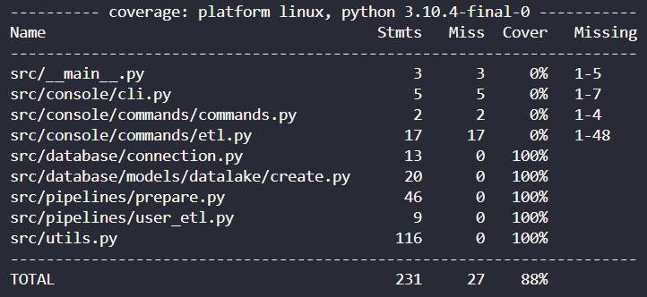

# Sicredi Data Engineering Test

This is a simple but **well documented and architected** data pipeline project for the **Sicredi Data Engineering Test**.


## Requirements:

* Docker: https://docs.docker.com/engine/install/ubuntu/#installation-methods
* Docker-compose: https://docs.docker.com/compose/install/
* Poetry: https://python-poetry.org/docs/
* Python >=3.10: https://www.python.org/downloads/

## To run tests:

```shell
git clone -b main git@github.com:marcosdotme/sicredi-data-engineering-test.git
```

```shell
cd sicredi-data-engineering-test
```

```shell
poetry install
```

```shell
poetry shell
```

```shell
docker-compose up -d database
```

```shell
python -m pytest -v --cov=src
```

```shell
docker-compose down
```

## Percent of code covered by tests



## To run the project:

```shell
git clone -b main git@github.com:marcosdotme/sicredi-data-engineering-test.git
```

```shell
cd sicredi-data-engineering-test
```

```shell
poetry install
```

```shell
poetry shell
```

```shell
docker-compose up -d database
```

```shell
python -m src etl
```

```shell
docker-compose down
```